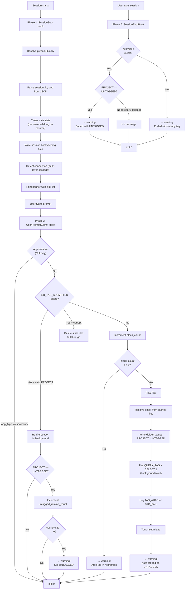
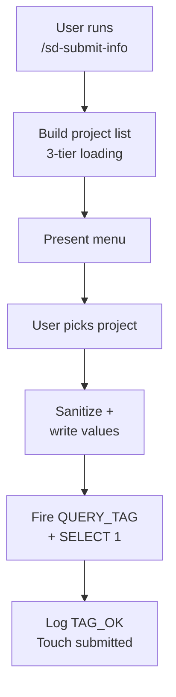
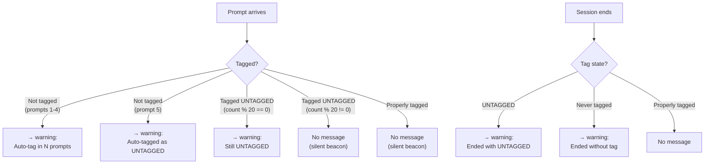
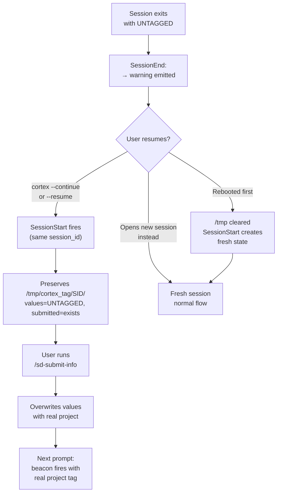

# End-to-End Flow Analysis: CLI & SnowWork

> Source of truth for the project-tracking hook pseudocode.
> Date: 2026-03-30
> Analyst: Cortex Code + tmathew

---

## Architecture Overview

Both CLI and SnowWork write files under `/tmp/cortex_tag/<SID>/`. Hooks are non-blocking — they always `exit 0`. Project selection and tag firing happen exclusively through the `sd-submit-info` skill. If the user never invokes the skill, a silent auto-tag fires after 5 untagged prompts. CLI hooks deliver warnings via `{"systemMessage":"..."}` JSON output, which CoCo injects as system-level instructions to the LLM. SnowWork hooks use plain `echo` text instead — the LLM reads the echo output directly and surfaces the warning in its response. (The `systemMessage` JSON approach did not work for SnowWork because the LLM would ingest the instruction but not relay it to the user.)

| Aspect | CLI | SnowWork |
|---|---|---|
| Session directory | `/tmp/cortex_tag/<SID>/` | `/tmp/cortex_tag/<SID>/` (same) |
| Connection | Two connections (inference + SQL); tags against the SQL connection | One connection — the active Snowflake connection; tags fire there directly |
| Project list source | `sd-submit-info` skill loads `sd_projects.txt` first (7-day TTL), `.snowhouse_cache` (24h TTL), Snowhouse fallback | Same (skill handles identically for both apps) |
| Menu display | `sd-submit-info` skill presents menu via `ask_user_question` | Same |
| Selection parsing | Skill handles selection natively | Same |
| Tag firing | Skill runs `snow sql` (CLI) or `snowflake_sql_execute` (SnowWork) | Same |
| Blocking mechanism | None — hooks always `exit 0` | Same |
| Untagged warning | `systemMessage` JSON from `UserPromptSubmit` hook — countdown (prompts 1-4), periodic reminder (every ~20 prompts while UNTAGGED) | Plain `echo` text from `UserPromptSubmit` hook — same countdown and reminder cadence, but delivered as raw text the LLM must surface |
| Auto-tag fallback | Silent auto-tag after 5 untagged prompts (fires `PROJECT=UNTAGGED`) | Same |
| Session end warning | `SessionEnd` hook emits `systemMessage` if session ends UNTAGGED or never tagged | `SessionEnd` hook emits plain `echo` text if session ends UNTAGGED or never tagged |

---

## Flow Diagrams

Visual representations of each phase are in [Appendix A: Mermaid Flow Diagrams](#appendix-a-mermaid-flow-diagrams) at the end of this document.

---

> **State files references** are documented in the [State Files Reference](#state-files-reference) after Phase 5.

---

# Unified Flow (CLI & SnowWork)

Both CLI and SnowWork follow the same phase structure. Differences are noted where they exist.

## Phase 1: Session Start — `SessionStart` hook fires once

**Hook:** `cli/session-tag-init.sh` (CLI) or `snowwork/session-tag-init.sh` (SnowWork)
**Trigger:** User launches `cortex` / `cortex -c <conn>` / `cortex --resume` (CLI) or opens a SnowWork session

```
INPUT:  JSON from runtime {session_id, cwd}
OUTPUT: temp files written, banner printed

1. Resolve python3 binary (from .python3_path file, then PATH)
2. If SD_CORTEX_TAG_ONLY env var is set → exit 0 (prevent recursion)
3. Parse session_id and cwd from hook input JSON
4. Clean stale state:
     a. Remove block_count (fresh count each session)
     b. If values file lacks valid PROJECT= line, remove values + submitted
        (supports --resume: preserves valid tag state from prior session)
5. Write app_type marker:
     CLI:      write "cli" only if app_type file doesn't already exist
     SnowWork: always write "snowwork" (takes priority over CLI)
6. Write session bookkeeping files:
     /tmp/cortex_tag/<SID>/session_id       = session_id
     /tmp/cortex_tag/<SID>/start_ts          = unix timestamp
     /tmp/cortex_tag/<SID>/cwd               = working directory
     /tmp/cortex_tag/latest_session           = session_id (CLI global pointer)
     /tmp/cortex_tag/snowwork/latest_session    = session_id (SnowWork global pointer)
7. Detect the Snowflake connection this session should tag against:
     CLI:      multi-layer cascade (hook input → PPID -c flag → connections.toml → config.toml → snow connection list)
     SnowWork: multi-layer cascade (hook input → settings.json → connections.toml → config.toml)
     Write result to /tmp/cortex_tag/<SID>/connection
8. Print banner:
     "Project-Milestone ID Tracking Active: Build v<VERSION> [(<APP>)]"
     "Session ID: <SID>"
     "Active Connection: <CONN> (<source>)" or warning if not detected
     ""
     "Tag your session by running one of these skills:"
     "  /sd-submit-info              (tag session with project/milestone)"
     "  /sd-project-list-setup       (generate/refresh project list)"
     "  /sd-verify-tracking          (verify installation)"
9. exit 0
```

**User sees:** Banner with available skills. Nothing blocks.

---

## Phase 2: Every Prompt — `UserPromptSubmit` hook fires, never blocks

**Hook:** `cli/user-prompt-check.sh` (CLI) or `snowwork/user-prompt-check.sh` (SnowWork)
**Trigger:** User types anything and hits enter

```
INPUT:  JSON from runtime {session_id, prompt}
OUTPUT: exit 0 (always — never blocks); optional warning on stdout
       CLI: systemMessage JSON    SnowWork: plain echo text

1. Resolve binaries:
     snow binary (from .snow_path file, then PATH)
     python3 binary (from .python3_path file, then PATH)
2. Parse session_id from hook input
3. If SD_CORTEX_TAG_ONLY set → exit 0
4. App isolation guard (CLI only):
     Read app_type from /tmp/cortex_tag/<SID>/app_type
     If app_type == "snowwork" → exit 0 (let SnowWork hook handle it)
5. Read TAG_CONN from /tmp/cortex_tag/<SID>/connection
6. Already tagged (SD_TAG_SUBMITTED exists):
     a. Validate SD_TAG_VALUES has ^PROJECT=.+
     b. If valid:
          - Source SD_TAG_VALUES
          - Build QUERY_TAG JSON
          - Re-fire beacon in background:
            snow sql "ALTER SESSION SET QUERY_TAG=...; SELECT 1;" &
          - If PROJECT == "UNTAGGED":
              Increment untagged_remind_count
              If count % 20 == 0:
                  → warning: "Session is still UNTAGGED. Run /sd-submit-info."
                    (CLI: systemMessage JSON; SnowWork: plain echo)
          - exit 0
     c. If invalid (corrupt state):
          - Delete both SD_TAG_SUBMITTED and SD_TAG_VALUES
          - Fall through to untagged path
7. Not tagged — increment block_count:
     BLOCK_COUNT_FILE = /tmp/cortex_tag/<SID>/block_count
     BLOCK_COUNT = read file, default 0, increment by 1, write back
8. If BLOCK_COUNT < 5 → countdown warning:
     REMAINING = 5 - BLOCK_COUNT
     → warning: "Session not tagged. Auto-tag as UNTAGGED in <REMAINING> prompt(s)."
       (CLI: systemMessage JSON; SnowWork: plain echo)
     exit 0
9. If BLOCK_COUNT >= 5 → auto-tag:
     a. Resolve email from cached files (first match wins):
          i.   sd_projects.txt (first non-comment entry, last pipe-delimited field)
          ii.  .snowhouse_cache (first entry, last field)
          iii. .last_selection_cli or .last_selection_snowwork (LAST_EMAIL= line)
          iv.  Fallback: "UNKNOWN"
     b. Sanitize email to [A-Za-z0-9_.@-]
     c. Write SD_TAG_VALUES:
          APP=<app_type>  (cortex_code_cli or snowwork)
          CUSTOMER=UNKNOWN
          PROJECT_ID=000
          PROJECT=UNTAGGED
          MILESTONE_ID=000
          MILESTONE=UNTAGGED
          EMAIL=<resolved_email>
     d. Build QUERY_TAG JSON
     e. Fire tag in background+wait:
          snow sql "ALTER SESSION SET QUERY_TAG=...; SELECT 1;" --connection <TAG_CONN> &
          wait $! → capture exit code
     f. Log to .tag_log:
          Success: <timestamp>|<SID>|TAG_AUTO|<app>|UNTAGGED/<email>|conn=<TAG_CONN>(<source>)
          Failure: <timestamp>|<SID>|TAG_FAIL|<app>|auto_tag_rc=<rc>|conn=<TAG_CONN>(<source>)
     g. Touch SD_TAG_SUBMITTED
     h. → warning: "Session auto-tagged as UNTAGGED. Run /sd-submit-info now."
          (CLI: systemMessage JSON; SnowWork: plain echo)
10. exit 0
```

**User sees:** Their prompt always reaches the LLM. While untagged, warnings are injected on each prompt — CLI uses `systemMessage` JSON (injected into LLM context by CoCo), SnowWork uses plain `echo` text (read directly by the LLM). After auto-tag, periodic reminders fire every ~20 prompts (~1 hour) while the session remains UNTAGGED.

---

## Warning Mechanism — Hook Output Delivery

CLI and SnowWork use different delivery mechanisms for warnings:

| App | Mechanism | How it works |
|---|---|---|
| CLI | `printf '{"systemMessage":"..."}\n'` | CoCo injects the JSON payload as a system-level instruction to the LLM. The LLM sees it in context and surfaces it. |
| SnowWork | `echo "IMPORTANT: You MUST display this warning..."` | The LLM reads the plain text output directly and is instructed to relay it to the user. The `systemMessage` JSON approach did not work for SnowWork — the LLM would ingest the instruction but not relay it visibly. |

Either way, warnings appear regardless of working directory or `.cortex/INSTRUCTIONS.md` presence.

Four warning tiers exist:

| Tier | When | Message |
|---|---|---|
| Countdown | Prompts 1-4 (untagged, before auto-tag) | "Not tagged. Auto-tag as UNTAGGED in N prompt(s)." |
| Auto-tag confirmation | Prompt 5 (auto-tag fires) | "Auto-tagged as UNTAGGED. Run /sd-submit-info now." |
| Periodic reminder | Every 20th prompt while UNTAGGED | "Still tagged as UNTAGGED. Run /sd-submit-info." |
| Session end | Session closes while UNTAGGED or never tagged | "Session ended with UNTAGGED / without any tag." *(see SE1 caveat below Phase 5)* |

> **Delivery format:** CLI emits all tiers as `{"systemMessage":"..."}` JSON. SnowWork emits all tiers as plain `echo` text prefixed with `"IMPORTANT: You MUST display this warning..."`. The message content is identical; only the delivery wrapper differs.

> **Note:** The `.cortex/INSTRUCTIONS.md` file still contains a note about hook-based warning delivery, but hook stdout output (systemMessage JSON for CLI, plain echo for SnowWork) is the primary mechanism. The INSTRUCTIONS.md approach is retained as a supplementary signal — it may help reinforce warnings when the LLM reads it, but it is not relied upon for warning delivery.

---

## Phase 3: User invokes `sd-submit-info` skill — proper tagging

**Skill:** `sd-submit-info` (installed to `~/.snowflake/cortex/skills/sd-submit-info/`)
**Trigger:** User types `/sd-submit-info` (with optional flags like `-0`, `-N`)

```
INPUT:  User invokes skill
OUTPUT: session tagged with real project data

1. Read session_id from /tmp/cortex_tag/latest_session (CLI)
   or /tmp/cortex_tag/snowwork/latest_session (SnowWork)
2. Check existing tag values — if already properly tagged, re-fire and done
3. Build project list (3-tier, same for CLI and SnowWork):
     i.   Read sd_projects.txt — if exists and has entries, use it (stop)
          Note: the skill trusts the file unconditionally; hooks enforce a 7-day TTL
     ii.  Read .snowhouse_cache — if exists, non-empty, and <24h old, use it (stop)
     iii. Query Snowhouse via snowflake_sql_execute --connection SNOWHOUSE
          Write results to .snowhouse_cache (shared between CLI and SnowWork)
4. Read previous selection:
     a. CWD-scoped: <cwd>/.cx_last_selection_<app>
     b. Global fallback: <hooks_dir>/.last_selection_<app>
5. Present numbered menu via ask_user_question
6. User picks a project (number, freeform, or -N flag shortcut)
7. Sanitize all values (strip special chars, escape quotes)
8. Write SD_TAG_VALUES file:
     APP=<app_type>
     CUSTOMER=...  PROJECT_ID=...  PROJECT=...
     MILESTONE_ID=...  MILESTONE=...  EMAIL=...
9. Save selection for future sessions:
     a. Global: <hooks_dir>/.last_selection_<app>
     b. CWD-scoped: <cwd>/.cx_last_selection_<app>
10. Build QUERY_TAG JSON:
     {"app":"<app_type>","customer":"...","project_id":"...","project":"...",
      "milestone_id":"...","milestone":"...","email":"...","session_id":"..."}
11. Fire tag:
     snowflake_sql_execute (both CLI and SnowWork — skill runs inside agent)
     Statement: ALTER SESSION SET QUERY_TAG = '<json>'; SELECT 1;
12. Log result to .tag_log:
     TAG_OK  → timestamp | session | app | customer/project/milestone
     TAG_FAIL → timestamp | session | app | error
13. Write SD_TAG_SUBMITTED marker file (always, even on failure)
14. Print: "Session tagged: X / Y / Z"
```

---

## Phase 4: All Subsequent Prompts — beacon re-fire with optional reminder

**Hook:** `cli/user-prompt-check.sh` or `snowwork/user-prompt-check.sh`
**Trigger:** Every prompt after tagging is complete

```
INPUT:  JSON with prompt = user's actual work prompt
OUTPUT: exit 0 (pass through, no blocking); optional warning if UNTAGGED
       (CLI: systemMessage JSON; SnowWork: plain echo)

1. SD_TAG_SUBMITTED exists AND SD_TAG_VALUES has valid PROJECT= line:
     a. Source SD_TAG_VALUES
     b. Build QUERY_TAG JSON
     c. Re-fire beacon in background:
          snow sql "ALTER SESSION SET QUERY_TAG=...; SELECT 1;" --connection <TAG_CONN> &
     d. If PROJECT == "UNTAGGED":
          Increment untagged_remind_count
          If count % 20 == 0 (~hourly at ~3 min/prompt):
              → warning: "Session is still UNTAGGED. Run /sd-submit-info."
                (CLI: systemMessage JSON; SnowWork: plain echo)
     e. exit 0 (prompt goes straight to the LLM unmodified)
```

**User sees:** Normal behavior. If the session was properly tagged via `sd-submit-info`, no warnings appear. If auto-tagged as UNTAGGED, a periodic reminder fires approximately every hour.

---

## Phase 5: Session End — `SessionEnd` hook fires once (non-blocking)

**Hook:** `cli/session-end.sh` (CLI) or `snowwork/session-end.sh` (SnowWork)
**Trigger:** User exits session (Ctrl+C+C, `/exit`, closes browser tab)

```
INPUT:  JSON from runtime {session_id}
OUTPUT: exit 0 (always — SessionEnd cannot block exit); optional warning
       (CLI: systemMessage JSON; SnowWork: plain echo)

1. Resolve python3 binary
2. Parse session_id from hook input
3. App isolation guard (CLI only):
     Read app_type from /tmp/cortex_tag/<SID>/app_type
     If app_type == "snowwork" → exit 0
4. Check tag state:
     a. If SD_TAG_SUBMITTED exists AND SD_TAG_VALUES exists:
          Read PROJECT from values file
          If PROJECT == "UNTAGGED":
              → warning: "Session ended with UNTAGGED. Run /sd-submit-info early next time."
                (CLI: systemMessage JSON; SnowWork: plain echo)
     b. If SD_TAG_SUBMITTED does NOT exist:
          → warning: "Session ended without any tag. Run /sd-submit-info at start of next session."
            (CLI: systemMessage JSON; SnowWork: plain echo)
     c. If properly tagged:
          No message.
5. exit 0
```

**User sees:** A final warning if the session was never tagged or was only auto-tagged as UNTAGGED. The session closes regardless — CoCo `SessionEnd` is non-blocking.

> **Known limitation (SE1):** The CLI hook fires and emits valid `systemMessage` JSON, but CoCo CLI's `quit` command may exit before reading/rendering the hook's stdout. The message is emitted but not displayed. This is a CoCo platform behavior — `SessionEnd` has `Block? = No` and the runtime is not required to wait for or render hook output during exit teardown. SnowWork behavior may differ (browser tab close vs. explicit quit). See [GAP_ANALYSIS.md](GAP_ANALYSIS.md#remaining-open-gaps) for tracking.

> **Recovery path:** For CLI, the user can `cortex --continue` or `cortex --resume <session_id>` to reopen the conversation. The same `/tmp/cortex_tag/<SID>/` directory is reused (SessionStart preserves existing tag state). Running `/sd-submit-info` in the resumed session overwrites the UNTAGGED values, and subsequent beacons carry the real project tag. See [FAQ: Fixing an UNTAGGED Session](FAQ.md#fixing-an-untagged-session).

---

## State Files Reference

| File | Written by | Read by | Lifetime |
|---|---|---|---|
| `/tmp/cortex_tag/<SID>/session_id` | Phase 1 (init) | diagnostics | session |
| `/tmp/cortex_tag/<SID>/start_ts` | Phase 1 (init) | diagnostics | session |
| `/tmp/cortex_tag/<SID>/cwd` | Phase 1 (init) | diagnostics | session |
| `/tmp/cortex_tag/<SID>/connection` | Phase 1 (init) | Phase 2 (beacon), Phase 3 (tag fire) | session |
| `/tmp/cortex_tag/<SID>/app_type` | Phase 1 (init) | Phase 2 (app isolation) | session |
| `/tmp/cortex_tag/latest_session` | Phase 1 (init) | sd-submit-info skill (CLI), INSTRUCTIONS.md warning, diagnostics | overwritten each CLI session |
| `/tmp/cortex_tag/snowwork/latest_session` | Phase 1 (init) | sd-submit-info skill (SnowWork) | overwritten each SnowWork session |
| `/tmp/cortex_tag/<SID>/block_count` | Phase 2 (each untagged prompt) | Phase 2 (auto-tag threshold) | session |
| `/tmp/cortex_tag/<SID>/untagged_remind_count` | Phase 4 (each UNTAGGED prompt) | Phase 4 (periodic reminder modulo) | session |
| `/tmp/cortex_tag/<SID>/values` | Phase 2 (auto-tag) or Phase 3 (skill) | Phase 2 (beacon gate), Phase 4 (beacon), Phase 5 (end warning) | session |
| `/tmp/cortex_tag/<SID>/submitted` | Phase 2 (auto-tag) or Phase 3 (skill) | Phase 2 (beacon gate), Phase 4 (beacon), Phase 5 (end warning) | session |
| `<hooks_dir>/.snowhouse_cache` | Phase 3 (Snowhouse query) | Phase 2 (auto-tag email), Phase 3 (menu build) | 24h TTL |
| `<hooks_dir>/sd_projects.txt` | sd-project-list-setup skill | Phase 2 (auto-tag email), Phase 3 (menu build) | 7-day TTL |
| `<cwd>/.cx_last_selection_cli` | Phase 3 (CLI skill) | Phase 3 (next CLI session) | persistent across sessions |
| `<cwd>/.cx_last_selection_snowwork` | Phase 3 (SnowWork skill) | Phase 3 (next SnowWork session) | persistent across sessions |
| `<hooks_dir>/.last_selection_cli` | Phase 3 (CLI skill) | Phase 2 (auto-tag email), Phase 3 (next CLI session) | persistent across sessions |
| `<hooks_dir>/.last_selection_snowwork` | Phase 3 (SnowWork skill) | Phase 2 (auto-tag email), Phase 3 (next SnowWork session) | persistent across sessions |
| `<hooks_dir>/.tag_log` | Phase 2 (auto-tag), Phase 3 (skill) | diagnose script | append-only |

### Tag Log Entry Types

| Type | Meaning | Format |
|---|---|---|
| `TAG_OK` | Skill successfully fired tag | `<ts>\|<SID>\|TAG_OK\|<app>\|<customer>/<project>/<milestone>` |
| `TAG_FAIL` | Tag attempt failed | `<ts>\|<SID>\|TAG_FAIL\|<app>\|auto_tag_rc=<rc>\|conn=<conn>(<source>)` |
| `TAG_AUTO` | Silent auto-tag fired (user never ran skill) | `<ts>\|<SID>\|TAG_AUTO\|<app>\|UNTAGGED/<email>\|conn=<conn>(<source>)` |

---

## Appendix A: Mermaid Flow Diagrams

### A1: Session Lifecycle (Phases 1 → 2 → 4 → 5)



### A2: sd-submit-info Skill (Phase 3)



### A3: Warning Tiers (CLI: systemMessage JSON / SnowWork: plain echo)



### A4: Session Resume Recovery Flow


