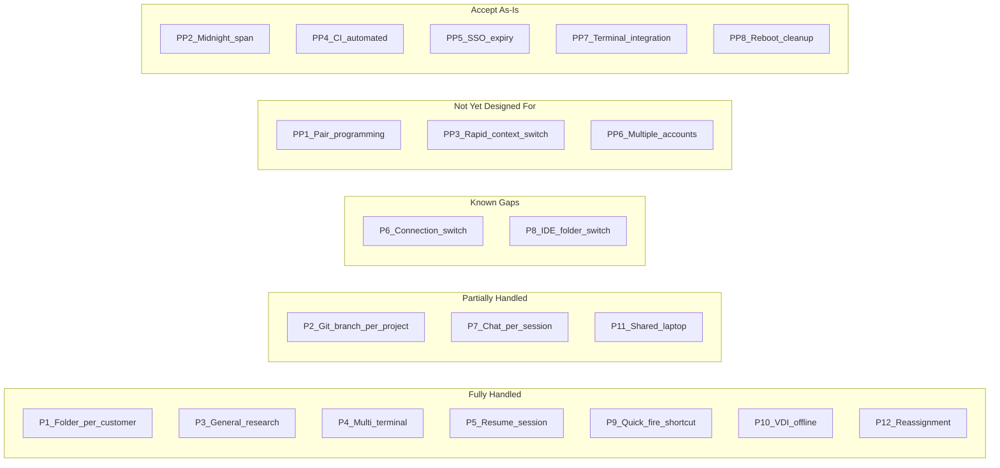

# User Operational Patterns

> Catalogs how users actually work with Cortex Code CLI and SnowWork,
> what the tracking system handles today, and potential patterns we may have missed.
> Date: 2026-03-27
> Authors: tmathew, Cortex Code

---

## Platform Context

| Platform | Session Lifecycle | Connection Model | Tagging Trigger |
|---|---|---|---|
| **CLI** | One session per `cortex` invocation. `--resume` reuses session_id. Multiple terminals = multiple sessions. | Two connections (inference + SQL); tags fire on the SQL connection detected at init. | User runs `sd-submit-info` skill to select a project. Hook shows a warning on each untagged prompt and auto-tags as `UNTAGGED` after 5 prompts. |
| **SnowWork** | Each chat conversation is a new session, even when the IDE stays open. Opening a new chat = new session_id. | One connection — the active Snowflake connection the IDE is using. | User runs `sd-submit-info` skill. Hook appends a warning to each response until tagged; auto-tags as `UNTAGGED` after 5 untagged prompts. |

---

## Known Patterns (designed for)

### CLI Patterns

#### P1: Folder-per-customer

The user maintains separate directories per customer engagement (e.g., `~/projects/acme-corp/`, `~/projects/contoso/`). They launch `cortex` from within each folder.

| Aspect | Detail |
|---|---|
| **How we handle it** | CWD-scoped `.cx_last_selection_cli` remembers the project per directory. Option 0 reuses the last selection for that folder. |
| **State files** | `<cwd>/.cx_last_selection_cli` (one per directory) |
| **Status** | Works well. |
| **Risk** | Two simultaneous CLI sessions in the same CWD cause a last-writer-wins race on `.cx_last_selection_cli`. Cosmetic only — both sessions are tagged independently. |

#### P2: Git branch per project

The user works in a single repo but uses branches to separate customer work (e.g., `feature/acme-migration`, `feature/contoso-etl`). They switch branches without changing CWD.

| Aspect | Detail |
|---|---|
| **How we handle it** | `.cx_last_selection_cli` is CWD-scoped, not branch-scoped. Same directory = same remembered selection regardless of branch. |
| **State files** | `<cwd>/.cx_last_selection_cli` |
| **Status** | Partially handled. |
| **Risk** | Branch switch does not trigger re-tagging. If the user switches branches (and thus projects) without starting a new session, the tag still points to the original project. The user must start a new `cortex` session to re-tag. |
| **Mitigation** | Document that branch switches require a new session for accurate tagging. |

#### P3: General research folder

The user has a single working directory (e.g., `~/research/`) and switches between projects across sessions. No per-customer folder structure.

| Aspect | Detail |
|---|---|
| **How we handle it** | `.cx_last_selection_cli` remembers the last project. Menu always available to pick a different one. |
| **State files** | `<cwd>/.cx_last_selection_cli`, `.last_selection_cli` (global fallback) |
| **Status** | Works. |
| **Risk** | Option 0 may point to the wrong project if the user frequently switches. Low risk — user sees the project name before confirming. |

#### P4: Multi-terminal CLI sessions

The user opens multiple terminal windows, each running a separate `cortex` session, potentially for different customers or tasks.

| Aspect | Detail |
|---|---|
| **How we handle it** | Each terminal gets a unique session_id and a separate `/tmp/cortex_tag/<SID>/` directory. Tags are independent. |
| **State files** | Per-session dirs (isolated). Shared: `.cx_last_selection_cli`, `.last_selection_cli` (last-writer-wins). |
| **Status** | Works. |
| **Risk** | Cosmetic race on `.cx_last_selection_cli` if sessions share the same CWD. `.tag_log` interleaves lines from concurrent sessions (each line is self-contained with session_id). |

#### P5: Resume previous session

The user resumes a prior session via `cortex --resume last` or `cortex --resume <session_id>`. This reuses the original session_id.

| Aspect | Detail |
|---|---|
| **How we handle it** | Init hook preserves valid `values`/`submitted` files (stale cleanup only removes invalid state). The already-tagged gate fires immediately, beacon re-fires on first prompt. |
| **State files** | `values`, `submitted` preserved if valid; `block_count` cleaned |
| **Status** | Works. |
| **Risk** | None — the user sees no menu, session continues with the original tag. |

#### P6: Connection switch mid-session

The user starts with `cortex -c conn_a`, then wants to work against a different Snowflake account mid-session (e.g., switching from dev to prod).

| Aspect | Detail |
|---|---|
| **How we handle it** | Connection is detected once at session start (Phase 1) and written to the `connection` file. It is NOT re-detected on subsequent prompts. |
| **State files** | `/tmp/cortex_tag/<SID>/connection` (frozen at init) |
| **Status** | Gap. |
| **Risk** | All tags and beacons fire on the original connection. If the user changes active connection mid-session, the tag fires on the wrong account. |
| **Mitigation** | User must start a new session to tag against a different connection. Document this limitation. |

### SnowWork Patterns

#### P7: Chat-per-session (SnowWork default)

Each new chat conversation in SnowWork is a separate session. The user starts multiple chats throughout the day.

| Aspect | Detail |
|---|---|
| **How we handle it** | Each chat gets a fresh session_id. User must run `sd-submit-info` per chat. |
| **State files** | Fresh `/tmp/cortex_tag/<SID>/` per chat. `.last_selection_snowwork` persists across chats. |
| **Status** | Works but repetitive. |
| **Risk** | Users may skip tagging on short chats. Auto-tag fires after 5 untagged prompts with `PROJECT=UNTAGGED`. |
| **Mitigation** | `-0` shortcut reuses last selection (one-step tagging). `-N` picks by cached number. |

#### P8: IDE folder switch

The user changes the active folder/workspace in SnowWork IDE while a chat is still open, or starts a new chat after switching folders.

| Aspect | Detail |
|---|---|
| **How we handle it** | CWD is captured at init, but SnowWork may not provide meaningful CWD. The `sd-submit-info` skill handles selection independently of CWD. |
| **State files** | `cwd` file written but not used for selection scoping |
| **Status** | Gap (SG3). |
| **Risk** | SnowWork now uses CWD-scoped `.cx_last_selection_snowwork` with global `.last_selection_snowwork` fallback, but CWD may not be meaningful in all SnowWork contexts. |
| **Mitigation** | Low impact — SnowWork selection is via skill, not hook. Folder context less relevant for SnowWork workflows. |

#### P9: Quick-fire skill shortcut

Experienced users invoke `sd-submit-info -0` or `sd-submit-info -N` to skip the menu entirely.

| Aspect | Detail |
|---|---|
| **How we handle it** | Skill reads `.snowhouse_cache` for `-N` or `.cx_last_selection_snowwork` (CWD) / `.last_selection_snowwork` (global) for `-0`. Tags without displaying menu. |
| **State files** | `.snowhouse_cache`, `.cx_last_selection_snowwork`, `.last_selection_snowwork` |
| **Status** | Works. |
| **Risk** | Cache can go stale if assignments change in Snowhouse. `-N` may pick wrong project if menu order changed. |
| **Mitigation** | Cache is rebuilt on next full `sd-submit-info` invocation. Stale cache = wrong pick is self-correcting. |

### Cross-Platform Patterns

#### P10: VDI / offline deploy

The user works on a customer VDI or air-gapped laptop with no Snowhouse access. `sd_projects.txt` is pre-bundled.

| Aspect | Detail |
|---|---|
| **How we handle it** | `sd_projects.txt` checked first (7-day TTL). No Snowhouse dependency when file is present and fresh. |
| **State files** | `sd_projects.txt` (static file, 7-day TTL) |
| **Status** | Works. |
| **Risk** | After 7 days, the file is considered stale and a Snowhouse refresh is attempted (which will fail on VDI). If Snowhouse is unreachable, the existing file is used regardless of age. |
| **Mitigation** | User can regenerate `sd_projects.txt` before deploying. Touch the file to reset the 7-day clock. |

#### P11: Shared laptop (multiple users)

Multiple consultants share a single machine (common on customer engagements). Each user runs `cortex` under their own Snowflake identity.

| Aspect | Detail |
|---|---|
| **How we handle it** | Session tagged with email from Snowhouse lookup (resolved from `CURRENT_USER()`). `.tag_log` has per-session attribution. |
| **State files** | All shared in `~/.snowflake/cortex/hooks/cx_projects_tracking/` |
| **Status** | Partially handled. |
| **Risk** | `.cx_last_selection_cli` / `.cx_last_selection_snowwork` may show another user's project. `.snowhouse_cache` may contain another user's assignments. |
| **Mitigation** | Each user should use their own OS account, or the hook could namespace cache files by Snowflake user. Not currently implemented. |

#### P12: Project reassignment mid-sprint

The user is reassigned to a different project. Their Snowhouse assignments change, but cached data still reflects the old assignment.

| Aspect | Detail |
|---|---|
| **How we handle it** | `.snowhouse_cache` has 24h TTL. `sd_projects.txt` has 7-day TTL. New assignments appear after cache expires. |
| **State files** | `.snowhouse_cache` (24h), `sd_projects.txt` (7 days) |
| **Status** | Works with delay. |
| **Risk** | Up to 24h before new project appears in Snowhouse-sourced menu. Up to 7 days for `sd_projects.txt`. |
| **Mitigation** | Delete `.snowhouse_cache` to force refresh. Regenerate `sd_projects.txt` via `sd-project-list-setup` skill. |

---

## Potential Patterns (not yet designed for)

### PP1: Pair programming

Two users share a screen/session. One user's Snowflake identity is used for the `cortex` session.

| Concern | The pair partner's activity is attributed to the session owner. No mechanism to record a second participant. |
|---|---|
| **Current behavior** | Tags with the session owner's email only. |
| **Impact** | Under-counting for the pair partner; over-counting for the session owner. |
| **Possible mitigation** | Support a `--pair` flag or env var that adds a secondary email to the query tag. Requires QUERY_TAG schema change (currently frozen at v1.6). |

### PP2: Session spanning midnight

A long-running session crosses a calendar day boundary. The tag was fired on day 1, but most work happens on day 2.

| Concern | Date-based reporting may attribute all queries to day 1 (tag fire time). |
|---|---|
| **Current behavior** | Single tag at session start. Beacon re-fires on each prompt but with the same session_id. |
| **Impact** | Low — `QUERY_HISTORY.START_TIME` on individual queries provides actual timestamps. Session_id is the unit of attribution, not date. |
| **Possible mitigation** | Accept. Reporting queries should use `START_TIME` per query, not just the beacon timestamp. |

### PP3: Rapid context switching within one session

The user works on 3 different customer problems in a single CLI session without restarting.

| Concern | All queries are attributed to the first-selected project. |
|---|---|
| **Current behavior** | One tag per session. No mid-session re-tag mechanism in CLI. SnowWork has separate chats, so this is CLI-only. |
| **Impact** | Medium — inaccurate attribution for multi-project sessions. |
| **Possible mitigation** | Allow `/sd-submit-info` in CLI to trigger a re-tag (hooks pass all prompts through without blocking, but the CLI does not currently support mid-session re-tagging via the skill). Requires script change to clear `values`/`submitted` and re-enter Phase 2. |

### PP4: CI/CD or automated sessions

Automated scripts launch `cortex` programmatically (e.g., for testing, batch processing, or CI pipelines).

| Concern | Bot sessions may pollute tag data with non-human activity. |
|---|---|
| **Current behavior** | `SD_CORTEX_TAG_ONLY=1` prevents recursion from tagging sub-sessions, but there's no general automation guard. |
| **Impact** | Low today (no known automated usage), but could grow. |
| **Possible mitigation** | Filter by `email` in reporting queries. Or add an `automated=true` field — but QUERY_TAG schema is frozen. |

### PP5: SSO token expiry mid-session

The user's SSO token (externalbrowser auth) expires during a long session. Beacon re-fire fails.

| Concern | Background beacon fire fails silently (`>/dev/null 2>&1 &`). Subsequent queries may lose the tag if the connection drops entirely. |
|---|---|
| **Current behavior** | Original tag persists in `QUERY_HISTORY` from the initial fire. Beacon failures are silent. |
| **Impact** | Low — the session tag was already recorded. Later queries use the Cortex runtime's own connection (separate from the tag connection). |
| **Possible mitigation** | Accept. Best-effort by design. `.tag_log` records the initial TAG_OK. |

### PP6: Multiple Snowflake accounts

The user has connections to multiple Snowflake accounts (e.g., personal Snowhouse + customer account). They want tags to fire on a specific one.

| Concern | Connection detection picks the first match from the cascade (JSON > PPID > connections.toml > config.toml). May fire on the wrong account. |
|---|---|
| **Current behavior** | CLI: 5-layer cascade. SnowWork: 4-layer cascade. First non-empty match wins. |
| **Impact** | Medium if default connection points to wrong account. |
| **Possible mitigation** | Always start with `-c <correct_connection>`. Document this as a best practice. |

### PP7: SnowWork terminal / task integration

If SnowWork adds integrated terminal or background task features, hooks may not fire in those contexts.

| Concern | Terminal sessions inside SnowWork IDE may not trigger `UserPromptSubmit` hooks. |
|---|---|
| **Current behavior** | Not applicable today. SnowWork hooks only fire on chat prompts. |
| **Impact** | Unknown — depends on future SnowWork features. |
| **Possible mitigation** | Monitor SnowWork roadmap. Test hooks when new IDE features ship. |

### PP8: System reboot / /tmp cleanup

The machine reboots or `/tmp` is cleaned by the OS. Session state in `/tmp/cortex_tag/<SID>/` is lost.

| Concern | If the user somehow resumes a session after reboot, the hook sees no state files and re-prompts for tagging. |
|---|---|
| **Current behavior** | Session state is ephemeral in `/tmp`. Lost on reboot. |
| **Impact** | Low — CLI sessions don't survive reboots. SnowWork IDE may reconnect but starts a new session_id. |
| **Possible mitigation** | Accept. Session restart after reboot is the expected flow. |

---

## Pattern Coverage Matrix

## Summary

| Category | Count | Patterns |
|---|---|---|
| Fully handled | 7 | P1, P3, P4, P5, P9, P10, P12 |
| Partially handled | 3 | P2 (branch), P7 (chat repetition), P11 (shared laptop) |
| Known gaps | 2 | P6 (connection switch), P8 (SnowWork CWD) |
| Not yet designed for | 3 | PP1 (pair), PP3 (context switch), PP6 (multi-account) |
| Accept as-is | 5 | PP2, PP4, PP5, PP7, PP8 |

---

## Relationship to Other Documents

- **Pseudocode**: [USER_FLOW_PSEUDOCODE.md](USER_FLOW_PSEUDOCODE.md) defines the hook behavior that implements these patterns
- **Gap Analysis**: [GAP_ANALYSIS.md](GAP_ANALYSIS.md) tracks where script behavior diverges from pseudocode
- **FAQ**: [FAQ.md](FAQ.md) covers user-facing troubleshooting for common pattern issues (multiple sessions, project list, diagnostics)
